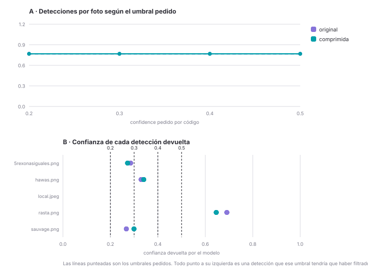

# Barrido de umbral de confianza

> Generado por `analizar_threshold.py` a partir de `resultados_threshold.csv`.
> Última corrida: 2026-09-09.
> Para rehacerlo: `python test_threshold.py <carpeta_con_fotos>` y después
> `python analizar_threshold.py`.

## Qué mide este experimento

Se corre el Workflow de Roboflow contra 5 fotos reales (`5rexonasiguales.png`, `hawas.png`, `local.jpeg`, `rasta.png`, `sauvage.png`), cada una en dos versiones —tal cual sale de la cámara y recomprimida— y con 4 valores distintos de `confidence` (0.5, 0.4, 0.3, 0.2): 40 corridas y 32 detecciones.

### Qué columnas tiene realmente el CSV

Conviene decirlo porque es distinto de lo que uno esperaría de un barrido de
umbral. `test_threshold.py` guarda:

`foto`, `variante`, `threshold`, `cantidad_detecciones`, `indice_deteccion`, `confianza`, `marca_ocr`, `ocr_exitoso`, `tiempo_respuesta_seg`, `tamano_bytes`

**No hay ninguna columna de verdad de referencia**: el CSV no dice qué producto
era realmente cada foto ni cuántos envases había. Por eso acá no se puede
calcular *aciertos* ni *falsos positivos* — eso hace falta etiquetar las fotos
a mano, y no está hecho. Lo que sí se puede medir es cuántas detecciones
devuelve el modelo, con qué confianza, y si el OCR llegó a leer la etiqueta.
El acierto contra la corrección humana se mide por otro lado: en la tabla
`correcciones_ia`, que es de lo que vive el panel "Rendimiento del modelo de IA"
(`consultar_metricas_ia.php`).

### Antes de leer los números: qué modelo corrió

Qué modelo ejecuta el workflow **no se decide en este repositorio**: se elige en
el editor de Roboflow y puede cambiar sin que se toque una línea de código, lo
que cambia los resultados de arriba por completo. Antes de citar esta tabla en
el informe, verificar cuál estaba corriendo:

```
GET https://api.roboflow.com/{workspace}/workflows/{workflow_id}?api_key=...
```

y mirar `specification.steps[0].model_id`. Un `yolo*-640` a secas es un modelo
genérico entrenado en COCO (detecta "botella", "celular", "persona"); el del
proyecto es `products-vweue-1d62m-...`. La diferencia en tasa de detección
entre uno y otro es enorme — ver la tabla comparativa en `CLAUDE.md`.

## Resumen por variante y umbral

| Variante | confidence pedido | Fotos con detección | Detecciones | Det./foto | Confianza prom. | Confianza mín. | OCR leyó | Tiempo prom. | Peso prom. |
|---|---|---|---|---|---|---|---|---|---|
| original | 0.5 | 4 de 5 | 4 | 0.8 | 0.393 | 0.267 | 3 de 4 | 2.51 s | 245 KB |
| original | 0.4 | 4 de 5 | 4 | 0.8 | 0.393 | 0.267 | 3 de 4 | 1.97 s | 245 KB |
| original | 0.3 | 4 de 5 | 4 | 0.8 | 0.393 | 0.267 | 3 de 4 | 1.74 s | 245 KB |
| original | 0.2 | 4 de 5 | 4 | 0.8 | 0.393 | 0.267 | 3 de 4 | 1.84 s | 245 KB |
| comprimida | 0.5 | 4 de 5 | 4 | 0.8 | 0.390 | 0.272 | 4 de 4 | 1.75 s | 85 KB |
| comprimida | 0.4 | 4 de 5 | 4 | 0.8 | 0.390 | 0.272 | 4 de 4 | 1.67 s | 85 KB |
| comprimida | 0.3 | 4 de 5 | 4 | 0.8 | 0.390 | 0.272 | 4 de 4 | 1.65 s | 85 KB |
| comprimida | 0.2 | 4 de 5 | 4 | 0.8 | 0.390 | 0.272 | 4 de 4 | 1.72 s | 85 KB |

## Detalle por foto

| Foto | Variante | Detecciones | Confianza | OCR leyó |
|---|---|---|---|---|
| 5rexonasiguales.png | original | 1 | 0.285 | Dou origina SEBRA PRO |
| 5rexonasiguales.png | comprimida | 1 | 0.272 | Dou origina STERIL PRO-CERAM |
| hawas.png | original | 1 | 0.330 | حسن HAWAS For Him |
| hawas.png | comprimida | 1 | 0.340 | HAWAS For Him BLACK |
| local.jpeg | original | 0 | — | — |
| local.jpeg | comprimida | 0 | — | — |
| rasta.png | original | 1 | 0.691 | (no leyó) |
| rasta.png | comprimida | 1 | 0.646 | NICE |
| sauvage.png | original | 1 | 0.267 | SAUVAGE EAU DE PARFUM |
| sauvage.png | comprimida | 1 | 0.299 | SAUVAGE EAU DE PARFUM |

## El gráfico



*(`umbral_confianza.svg`, al lado de este archivo. Se abre en cualquier
navegador y Word 2016 en adelante lo importa como vectorial, así que no se
pixela al agrandarlo.)*

## Qué umbral se eligió y por qué

**No se eligió ningún umbral, porque el umbral no se puede elegir por código.** En las 10 combinaciones foto/variante la cantidad de detecciones fue exactamente la misma con `confidence` en 0.5, 0.4, 0.3, 0.2: el parámetro no llega al modelo.

La prueba directa está en el panel B del gráfico: 16 de las 32 detecciones volvieron con una confianza MENOR al umbral que se había pedido. Si el filtro se estuviera aplicando, ninguna predicción por debajo del umbral podría llegar.

La causa es que el step del modelo, en el editor visual de Roboflow, no tiene su campo `confidence` enlazado a un input del workflow, así que lo que manda `ejecutar_workflow_stock(..., confidence=X)` se ignora. Mientras siga así, el umbral hay que cambiarlo a mano en el editor de Roboflow y publicar el workflow de nuevo — y `CONFIDENCE_THRESHOLD` en `main.py` tampoco está teniendo el efecto que aparenta.

Para el informe esto no es un resultado negativo: es el resultado. El experimento se diseñó para justificar un umbral con datos propios y lo que encontró fue que el umbral que se creía configurado no lo estaba. Justificar un número elegido a ojo habría sido escribir una conclusión falsa sobre datos reales.
